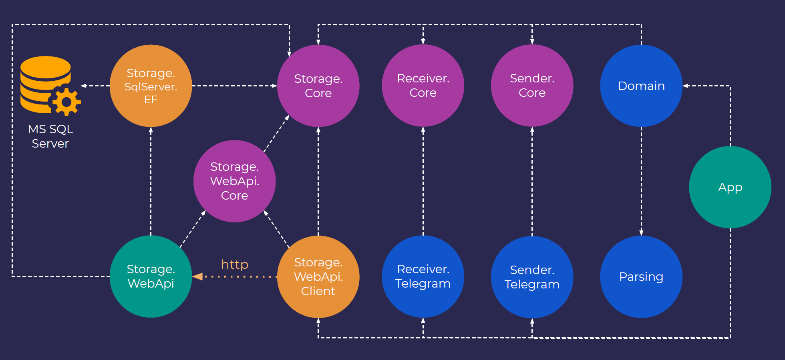

# cs-course-project4
Nordic IT School: Graduation project for the second half of the course (v.4)

Reminder application implemented as a Telegram bot that can schedule postponed notifications to send them back to users later.

Based on an Microsoft SQL Server database as data storage that is accessible through the Web API application. Access to the SQL Server is organized via Entity Framework Core.

  
*(high-level module relations diagram)*  